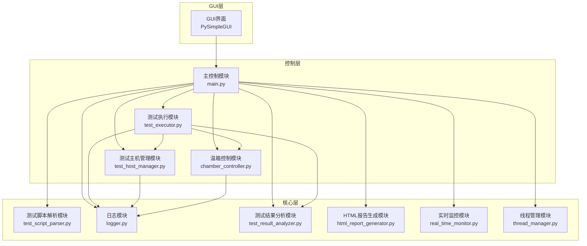

# NVMe SSD测试系统技术文档

## 1. 项目概述

NVMe SSD测试系统是一个用于自动化测试NVMe固态硬盘的综合测试平台。该系统通过控制高低温试验箱和多台Linux测试主机，实现对SSD在各种温度条件下的性能和可靠性测试。

### 1.1 系统目标

- 提供自动化的NVMe SSD测试解决方案
- 支持多温度环境下的测试
- 支持多测试主机并行测试
- 提供详细的测试报告和数据分析
- 提高测试效率和准确性

### 1.2 系统特点

- **多温度环境测试**：通过串口控制高低温试验箱，实现不同温度条件下的测试
- **多主机并行测试**：支持同时测试多台主机上的SSD
- **多种测试类型**：支持PCT（开关机测试）、BIT（老化测试）、CTTW（跨温区写测试）、CTTR（跨温区读测试）
- **实时监控**：实时监控温度、测试进度和系统状态
- **详细的测试报告**：生成HTML格式的测试报告，包含测试结果、错误信息和温度曲线等
- **自动化测试脚本**：支持通过INI格式的测试脚本定义测试流程

## 2. 系统架构

### 2.1 硬件架构

- **Console主机**：Windows系统，运行测试软件，负责控制整个测试流程
- **测试主机**：若干台Linux系统，连接被测SSD，执行具体的测试命令
- **高低温试验箱**：用于创建不同的温度测试环境

### 2.2 软件架构

系统采用模块化设计，主要包含以下模块：



### 2.3 数据流

1. **配置数据**：从`config.ini`文件加载系统配置
2. **测试脚本**：从测试脚本文件解析测试命令
3. **测试数据**：通过SSH从测试主机获取SSD信息和测试结果
4. **温度数据**：通过串口从温箱获取温度数据
5. **日志数据**：记录测试过程中的各种事件和结果
6. **报告数据**：生成HTML格式的测试报告

## 3. 核心功能模块

### 3.1 GUI界面模块

- **功能**：提供用户交互界面，展示测试状态和结果
- **实现**：使用PySimpleGUI库实现
- **主要组件**：
  - 温箱控制标签页
  - 测试控制标签页
  - 实时监控标签页
- **关键功能**：
  - 串口配置和连接
  - 温度设定和读取
  - 测试脚本加载和验证
  - 测试主机选择和控制
  - 测试启动、暂停和停止
  - 测试报告生成和查看

### 3.2 温箱控制模块

- **功能**：控制高低温试验箱，实现温度设定和监控
- **实现**：使用pyserial库实现串口通信
- **支持的命令集**：
  - 命令集1：Modbus RTU协议
  - 命令集2：ASCII协议
- **主要功能**：
  - 启动/停止温箱
  - 设定目标温度
  - 读取当前温度
  - 等待温度达到目标值
  - 温度保温

### 3.3 测试主机管理模块

- **功能**：管理测试主机，包括唤醒、连接、关机等操作
- **实现**：使用paramiko库实现SSH连接
- **主要功能**：
  - Wake-on-LAN唤醒主机
  - SSH连接主机
  - 执行命令获取SSD信息
  - 监控主机状态
  - 发送关机命令
  - 获取SSD列表和信息
  - 获取SSD温度
  - 获取SSD链路状态
  - 获取SSD SMART信息

### 3.4 测试执行模块

- **功能**：执行各种测试命令，包括温度命令和测试命令
- **实现**：使用多线程并行执行测试
- **支持的测试类型**：
  - **PCT测试**：开关机测试，验证SSD在开关机过程中的稳定性
  - **BIT测试**：老化测试，验证SSD在长时间写入操作后的性能
  - **CTTW测试**：跨温区写测试，验证SSD在温度变化时的写入性能
  - **CTTR测试**：跨温区读测试，验证SSD在温度变化时的读取性能
- **主要功能**：
  - 执行温度命令，设定和保持温度
  - 执行PCT测试，包括唤醒、测试和关机
  - 执行BIT测试，使用fio工具进行写入测试
  - 执行CTTW测试，进行全盘写测试
  - 执行CTTR测试，进行全盘读测试
  - 监控测试进度和结果

### 3.5 测试脚本解析模块

- **功能**：解析测试脚本文件，提取测试命令
- **实现**：使用configparser库解析INI格式的测试脚本
- **支持的命令**：
  - `TEMP`：设定温度和保温时间
  - `PCT`：执行开关机测试
  - `BIT`：执行老化测试
  - `CTTW`：执行跨温区写测试
  - `CTTR`：执行跨温区读测试

### 3.6 日志模块

- **功能**：记录系统运行日志和测试结果
- **实现**：自定义日志类，支持不同级别的日志
- **主要功能**：
  - 记录控制台日志
  - 记录测试结果日志
  - 记录错误信息
  - 生成温度监控数据

### 3.7 测试结果分析模块

- **功能**：分析测试结果，检测错误和异常
- **实现**：自定义分析类，解析测试日志
- **主要功能**：
  - 分析测试结果数据
  - 检测SSD掉盘、识别异常等错误
  - 生成测试统计信息
  - 提供数据给报告生成模块

### 3.8 HTML报告生成模块

- **功能**：生成HTML格式的测试报告
- **实现**：使用HTML模板和CSS样式
- **主要功能**：
  - 生成测试报告HTML文件
  - 包含测试结果、错误信息和温度曲线
  - 提供美观的报告界面

### 3.9 实时监控模块

- **功能**：实时监控系统状态和测试进度
- **实现**：使用线程实现实时监控
- **主要功能**：
  - 监控温度变化
  - 监控测试进度
  - 监控SSD状态
  - 显示监控结果到GUI

### 3.10 线程管理模块

- **功能**：管理系统中的线程，确保线程安全和资源合理使用
- **实现**：自定义线程池和资源管理类
- **主要功能**：
  - 管理线程池
  - 提交任务到线程池
  - 监控内存使用
  - 清理资源

## 4. 技术栈和依赖

### 4.1 核心技术

- **编程语言**：Python 3.8+
- **操作系统**：Windows 10/11 (Console主机)，Linux (测试主机)
- **GUI框架**：PySimpleGUI 4.x
- **串口通信**：pyserial
- **SSH通信**：paramiko
- **配置解析**：configparser
- **数据可视化**：matplotlib
- **数学计算**：numpy
- **系统监控**：psutil
- **Windows API**：pywin32

### 4.2 依赖库

| 依赖库 | 版本 | 用途 |
|--------|------|------|
| PySimpleGUI-4-foss | 4.60.4.1 | GUI界面 |
| paramiko | 4.0.0 | SSH连接 |
| pyserial | 3.5 | 串口通信 |
| pywin32 | 311 | Windows API |
| configparser | 7.2.0 | 配置文件解析 |
| matplotlib | 3.10.8 | 数据可视化 |
| numpy | 2.4.1 | 数学计算 |
| psutil | 7.2.1 | 系统监控 |

## 5. 系统配置

### 5.1 配置文件结构

系统使用`config.ini`文件存储配置信息，主要包含以下部分：

- **[serial]**：串口配置，包括端口、波特率等
- **[chamber]**：温箱配置，包括命令集和等待时间
- **[test_hosts]**：测试主机配置，包括IP地址、MAC地址等
- **[ssh]**：SSH配置，包括用户名、密码等
- **[pct]**：PCT测试配置
- **[bit]**：BIT测试配置
- **[cttw]**：CTTW测试配置
- **[cttr]**：CTTR测试配置
- **[logging]**：日志配置
- **[analysis]**：分析配置

### 5.2 测试脚本格式

测试脚本使用INI格式，支持以下命令：

- **TEMP**：设定温度和保温时间
  ```ini
  TEMP <温度> <保温时间(秒)>
  ```
  示例：
  ```ini
  TEMP 25 100
  TEMP -42 3600
  TEMP 87 3600
  ```

- **PCT**：开关机测试
  ```ini
  PCT <测试轮数>
  ```
  示例：
  ```ini
  PCT 10
  PCT 100
  ```

- **BIT**：老化测试
  ```ini
  BIT <测试容量百分比(1-100)>
  ```
  示例：
  ```ini
  BIT 1
  BIT 100
  ```

- **CTTW**：跨温区写测试
  ```ini
  CTTW
  ```

- **CTTR**：跨温区读测试
  ```ini
  CTTR
  ```

## 6. 测试流程

### 6.1 系统启动流程

1. 启动测试软件
2. 加载配置文件
3. 初始化各模块
4. 显示GUI界面
5. 等待用户操作

### 6.2 测试执行流程

1. **配置准备**：
   - 配置串口连接
   - 配置测试主机信息

2. **脚本加载**：
   - 选择测试脚本文件
   - 验证脚本格式
   - 解析脚本命令

3. **测试执行**：
   - 选择测试主机
   - 启动温箱（如果需要）
   - 执行测试命令：
     - 执行温度命令（设定温度和保温）
     - 执行PCT测试
     - 执行BIT测试
     - 执行CTTW测试
     - 执行CTTR测试
   - 监控测试进度和温度

4. **测试完成**：
   - 生成测试报告
   - 分析测试结果
   - 显示测试完成信息

### 6.3 测试数据流程

1. 测试软件发送命令到测试主机
2. 测试主机执行命令并返回结果
3. 测试软件接收并解析结果
4. 测试软件记录结果到日志文件
5. 测试完成后分析日志文件
6. 生成测试报告

## 7. 测试类型详解

### 7.1 PCT测试（开关机测试）

**目的**：验证SSD在开关机过程中的稳定性

**测试流程**：
1. 唤醒测试主机
2. 等待主机上线
3. 连接主机
4. 获取SSD信息并检查一致性
5. 执行FIO测试
6. 关机
7. 等待主机关机
8. 重复以上步骤指定的轮数

**测试参数**：
- 测试轮数
- 唤醒后等待时间
- 关机后等待时间
- FIO测试大小

### 7.2 BIT测试（老化测试）

**目的**：验证SSD在长时间写入操作后的性能和稳定性

**测试流程**：
1. 唤醒测试主机
2. 等待主机上线
3. 连接主机
4. 获取SSD信息并检查一致性
5. 记录初始温度
6. 开始温度监控
7. 执行FIO测试（写入指定百分比的容量）
8. 记录结束温度
9. 关机
10. 等待主机关机

**测试参数**：
- 测试容量百分比
- 温度检查间隔

### 7.3 CTTW测试（跨温区写测试）

**目的**：验证SSD在温度变化时的写入性能和稳定性

**测试流程**：
1. 唤醒测试主机
2. 等待主机上线
3. 连接主机
4. 获取SSD信息并检查一致性
5. 记录初始温度
6. 开始温度监控
7. 执行FIO测试（全盘写）
8. 记录结束温度
9. 关机
10. 等待主机关机

**测试参数**：
- 温度检查间隔

### 7.4 CTTR测试（跨温区读测试）

**目的**：验证SSD在温度变化时的读取性能和稳定性

**测试流程**：
1. 唤醒测试主机
2. 等待主机上线
3. 连接主机
4. 获取SSD信息并检查一致性
5. 记录初始温度
6. 开始温度监控
7. 执行FIO测试（全盘读）
8. 记录结束温度
9. 关机
10. 等待主机关机

**测试参数**：
- 温度检查间隔

## 8. 系统部署

### 8.1 环境要求

- **Console主机**：
  - Windows 10/11
  - Python 3.8+
  - 可用的串口
  - 网络连接到测试主机

- **测试主机**：
  - Linux操作系统
  - SSH服务
  - Wake-on-LAN功能
  - NVMe SSD驱动
  - fio工具

- **高低温试验箱**：
  - 支持串口控制
  - 支持设定温度范围：-60°C ~ 150°C

### 8.2 安装步骤

1. **克隆或下载项目代码**

2. **安装Python依赖包**

   **推荐方式：使用清华镜像源（速度快）**
   
   运行 `install_dependencies.bat` 脚本即可自动安装所有依赖库。
   
   或手动使用清华镜像源：
   
   ```bash
   pip install -r requirements.txt -i https://pypi.tuna.tsinghua.edu.cn/simple
   ```

3. **配置系统参数**

   编辑 `config.ini` 文件，设置以下参数：
   - 串口配置（端口、波特率等）
   - 测试主机配置（IP地址、MAC地址等）
   - SSH配置（用户名、密码等）
   - 测试参数配置

4. **准备测试脚本**

   编辑 `test_script.ini` 文件，定义测试流程

5. **连接硬件**

   - 连接Console主机到高低温试验箱（串口）
   - 连接Console主机到测试主机（网络）
   - 连接测试主机到被测SSD

## 9. 系统使用指南

### 9.1 启动系统

运行 `main.py` 文件启动测试系统：

```bash
python main.py
```

### 9.2 界面操作

#### 9.2.1 温箱控制

1. **连接串口**：
   - 输入COM口号
   - 点击"保存"按钮
   - 点击"连接串口"按钮

2. **读取温度**：
   - 点击"读取温度"按钮

3. **设定温度**：
   - 输入目标温度
   - 点击"设定温度"按钮

4. **启动/停止温箱**：
   - 点击"启动温箱"或"停止温箱"按钮

#### 9.2.2 测试脚本

1. **选择脚本**：
   - 点击"选择文件"按钮
   - 选择测试脚本文件

2. **加载脚本**：
   - 点击"加载脚本"按钮

3. **预览脚本**：
   - 点击"预览脚本"按钮

4. **验证脚本**：
   - 点击"验证脚本"按钮

#### 9.2.3 测试控制

1. **选择测试主机**：
   - 勾选要测试的主机

2. **主机操作**：
   - 点击"主板开机"按钮唤醒主机
   - 点击"连接主板"按钮连接主机
   - 点击"主板关机"按钮关闭主机

3. **测试操作**：
   - 点击"开始测试"按钮开始测试
   - 点击"暂停测试"按钮暂停测试
   - 点击"停止测试"按钮停止测试

#### 9.2.4 测试报告

1. **选择报告路径**：
   - 点击"选择存储路径"按钮
   - 选择报告存储目录

2. **生成报告**：
   - 测试完成后，点击"生成HTML报告"按钮

3. **打开报告**：
   - 点击"打开报告"按钮

4. **打开报告路径**：
   - 点击"打开路径"按钮

### 9.3 常见操作示例

#### 9.3.1 执行PCT测试

1. 配置串口连接
2. 选择测试脚本文件，包含PCT命令
3. 加载并验证脚本
4. 选择测试主机
5. 点击"开始测试"按钮
6. 测试完成后生成报告

#### 9.3.2 执行多温度测试

1. 配置串口连接
2. 选择测试脚本文件，包含多个TEMP命令和测试命令
3. 加载并验证脚本
4. 选择测试主机
5. 点击"开始测试"按钮
6. 测试完成后生成报告

## 10. 故障排除

### 10.1 常见问题

| 问题 | 可能原因 | 解决方案 |
|------|---------|--------|
| 串口连接失败 | 串口号错误 | 检查并修正COM口号 |
| 串口连接失败 | 串口被占用 | 关闭占用串口的程序 |
| 温箱控制失败 | 命令集错误 | 检查并修正命令集配置 |
| 主机唤醒失败 | MAC地址错误 | 检查并修正MAC地址 |
| 主机唤醒失败 | WOL功能未启用 | 在主机BIOS中启用WOL功能 |
| SSH连接失败 | IP地址错误 | 检查并修正IP地址 |
| SSH连接失败 | 用户名/密码错误 | 检查并修正用户名/密码 |
| 测试失败 | SSD未正确连接 | 检查SSD连接 |
| 测试失败 | fio工具未安装 | 在测试主机上安装fio工具 |
| 测试报告生成失败 | 路径权限不足 | 确保报告路径有写入权限 |

### 10.2 日志分析

系统生成的日志文件：

- **控制台日志**：`./console_log/log.txt`
- **测试日志**：`./nvme_test_log/<测试时间>/<SSD SN>/<文件名>.txt`

通过分析这些日志文件，可以了解测试过程中的详细信息和错误原因。

### 10.3 系统诊断

1. **检查网络连接**：
   - 使用ping命令测试Console主机与测试主机的连接

2. **检查串口连接**：
   - 使用串口调试工具测试串口连接

3. **检查测试主机状态**：
   - 检查测试主机是否开机
   - 检查SSH服务是否运行

4. **检查SSD连接**：
   - 在测试主机上执行 `ls /dev/nvme*` 命令检查SSD是否被识别

## 11. 系统扩展与未来发展

### 11.1 系统扩展

1. **支持更多测试类型**：
   - 增加性能测试
   - 增加可靠性测试
   - 增加寿命测试

2. **支持更多硬件**：
   - 支持更多类型的温箱
   - 支持更多类型的测试主机
   - 支持更多类型的存储设备（如SATA SSD、HDD等）

3. **增强数据分析**：
   - 增加更详细的数据分析
   - 增加数据可视化功能
   - 增加历史数据对比功能

4. **增强用户界面**：
   - 增加更直观的界面
   - 增加更多的配置选项
   - 增加更多的监控功能

### 11.2 未来发展

1. **云化**：
   - 实现测试系统的云化部署
   - 支持远程监控和管理

2. **智能化**：
   - 实现测试流程的自动化
   - 实现测试结果的智能分析
   - 实现故障的自动诊断

3. **标准化**：
   - 建立标准化的测试流程
   - 建立标准化的测试报告
   - 建立标准化的测试指标

4. **生态化**：
   - 与其他测试工具集成
   - 与CI/CD系统集成
   - 与产品管理系统集成

## 12. 总结

NVMe SSD测试系统是一个功能强大、灵活可靠的自动化测试平台，能够满足NVMe SSD在不同温度条件下的测试需求。系统通过模块化设计，实现了温箱控制、测试主机管理、测试执行、结果分析等功能，为SSD测试提供了全面的解决方案。

系统的主要优势在于：

- **自动化程度高**：通过测试脚本和自动化控制，减少了人工操作，提高了测试效率
- **测试覆盖全面**：支持多种测试类型和温度环境，确保测试的全面性
- **多主机并行测试**：支持同时测试多台主机上的SSD，提高了测试效率
- **详细的测试报告**：生成HTML格式的测试报告，包含详细的测试结果和数据分析
- **实时监控**：实时监控温度、测试进度和系统状态，便于及时发现问题

随着SSD技术的不断发展，NVMe SSD测试系统也将不断演进，以适应新的测试需求和挑战。通过持续的改进和扩展，系统将成为SSD测试领域的重要工具，为SSD产品的质量保证提供有力支持。